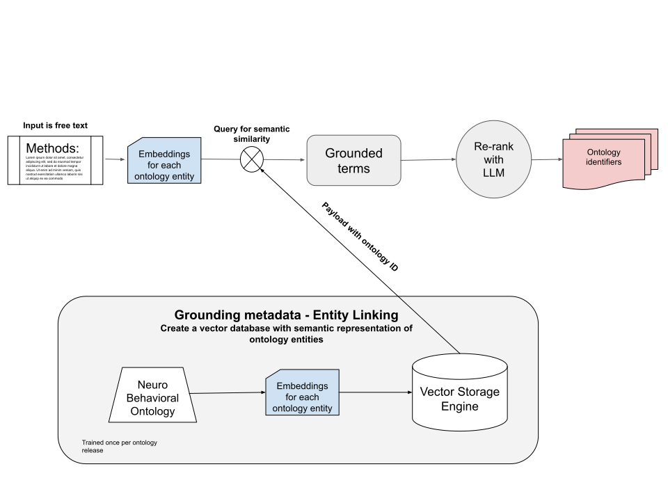

# Ontology Matching Service


The ontology matching service is an exepriment on using the technology of LLMs to facilitate provenance in scientific research. The basic idea is that precise terms from ontologies are matched to free form text (e.g. the method section of a paper). In the following link a prototype of the service is available that implements matching to ontologies from the [Neurobehavioral Ontology](https://bioportal.bioontology.org/ontologies/NBO) and the [Cognitive Atlas](https://www.cognitiveatlas.org/).

Test the service in the following link:

[link](https://ontology-matching-frontend.delightfulsand-a1030a48.centralus.azurecontainerapps.io/)


## Some examples to test:


Here are some examples that we have used to test the model. 

From: `Oxytocin neurons enable social transmission of maternal behaviour`

> This test was used for the initial screening of dams and virgin female mice. In addition, outside of the spontaneous home cage behaviours, we specifically monitored pup retrieval every 24 h by the virgin females. We placed the female mouse to be tested in a behavioural arena (38 × 30 × 15 cm) containing bedding and nesting material; the female was alone, without contact with other animals. Each animal was given 20 min to acclimatize before each testing session began. The entire litter (ranging from 3 to 7 P1–4 pups) were grouped in a corner of the arena and covered with nesting material, and the adult female given an additional 2 min of acclimatization (pup group size did not affect retrieval behaviour; Extended Data Fig. 2c). One pup was removed from the nest and placed in an opposite corner of the arena. The experimental female was given 2 min per trial to retrieve the displaced pup and return it back to the nest; if the displaced pup was not retrieved within 2 min, the pup was returned to the nest and the trial was scored as a failure. If the pup was successfully retrieved, the time to retrieval was recorded and the trial was scored as a success. Another pup was then taken out of the nest, placed away from the nest (varying the position of the isolated pup relative to the nest from trial to trial), and the next trial was begun. After ten trials, pups were placed back into their home cage with their dam. We used an ultrasonic microphone (Avisoft) to verify that isolated pups vocalized during testing

From: `Developments of a water-maze procedure for studying spatial learning in the rat`

> The essential feature of the technique is as follows: rats are placed into a large circular pool of water from which they can escape onto a hidden platform. The platform is hidden, first by arranging that its top surface is just beneath the water surface, and second by rendering the water opaque so that the platform is invisible. Thus the platform offers no local cues to guide escape behaviour. In principle, rats could escape from the wafer by swimming randomly, or in unsystematic search paths throughout the pool; but in practice, normal rats very quickly learn to swim directly towards the platform from any starting position at the circumference of the pool. The accurate directionality of their escape behaviour (and other measures of performance) provide evidence that the rats escape by learning the spatial position of the platform relative to distal cues. Comparison of the performance of normal and brain-damaged rats (Morris et al., 1982; Sutherland et al., 1983), and of rats given drugs (Sutherland et al., 1982) or cerebral neurotoxins (Hagan et al., 1983) offers a new way of examining the neurobiology of spatial learning

From: `Temporal and Spectral Sensitivity of Complex Auditory Neurons in the Nucleus HVc of Male Zebra Finches`

> Song selection and recording Two to three days before the experiment, an adult male zebra finch was placed in a sound-attenuated chamber (Acoustic Systems, Austin, TX) to obtain clear audio recordings of its mature, crystallized song (this species usually sings only one song type as adults). An automatically triggered audio system was used to record ;90 min of bird sounds, containing many samples of the song of the bird. The tape was scanned, and 10 loud, clear songs were digitized at 32 kHz and stored on a computer. Those songs were assessed further by calculating their spectrograms and by examining them visually. A representative version was then chosen from those 10 renditions and analyzed by a custom-made computer program to obtain a parametric representation based on the spectral and temporal components of the song (see below). Zebra finch songs are organized into simple elements often called syllables. These syllables are in turn organized into a set sequence that is called a song phrase or motif. The motif is repeated multiple times in a song (Zann, 1996, pp 214–215). We chose songs that varied in length between 1.1 and 2.3 sec and consisted of two or three motifs. The length of the song is important because it has been reported that HVc neurons integrate over long periods of time and that the maximal responses are not necessarily found in the first motif (Margoliash and Fortune, 1992; Sutter and Margoliash, 1994).

## Architecture
The service is composed of two main components: a backend and a frontend. The backend is a FastAPI service that uses the OpenAI API to generate embeddings for the text and then uses the Qdrant API to search for the most similar ontologies. The frontend is a React app that allows the user to input text and get the most similar ontologies.

The backend architecture is as follows:





# Testing

### Python API

Clone the repository and go to the root folder of the project, then install the package with the following command:

``` 
pip install .
```

Then you can test the package with the following command:

```python
from ontology_matching_service.ontology_grounding import semantic_match, rerank, process_response


top = 30

score_threshold = 0.50
ontology = "neuro_behavior_ontology"

text = """
This test was used for the initial screening of dams and virgin female mice. In addition, outside of the spontaneous home cage behaviours, we specifically monitored pup retrieval every 24 h by the virgin females. We placed the female mouse to be tested in a behavioural arena (38 × 30 × 15 cm) containing bedding and nesting material; the female was alone, without contact with other animals. Each animal was given 20 min to acclimatize before each testing session began. The entire litter (ranging from 3 to 7 P1–4 pups) were grouped in a corner of the arena and covered with nesting material, and the adult female given an additional 2 min of acclimatization (pup group size did not affect retrieval behaviour; Extended Data Fig. 2c). One pup was removed from the nest and placed in an opposite corner of the arena. The experimental female was given 2 min per trial to retrieve the displaced pup and return it back to the nest; if the displaced pup was not retrieved within 2 min, the pup was returned to the nest and the trial was scored as a failure. If the pup was successfully retrieved, the time to retrieval was recorded and the trial was scored as a success. Another pup was then taken out of the nest, placed away from the nest (varying the position of the isolated pup relative to the nest from trial to trial), and the next trial was begun. After ten trials, pups were placed back into their home cage with their dam. We used an ultrasonic microphone (Avisoft) to verify that isolated pups vocalized during testing
"""

results_list = semantic_match(text=text, top=top, score_threshold=score_threshold, ontology=ontology)
if ontology in ["neuro_behavior_ontology"]:
    results_list = rerank(results_list, text, ontology=ontology)
    
response = process_response(results_list)
response
```

The output should be something like this:

```json
{'NBO:0000155': {'name': 'offspring retrieval',
  'definition': "Behavior related to the parent's tendency to collect stray offspring and return them to a defined location."},
 'NBO:0000156': {'name': 'nesting behavior', 'definition': ''},
 'NBO:0000152': {'name': 'maternal nurturing behavior',
  'definition': 'Maternal behavior related to the brining up her offspring.'},
 'NBO:0000150': {'name': 'maternal behavior',
  'definition': 'Behavior of a mother towards her offspring.'},
 'NBO:0000559': {'name': 'maternal grooming',
  'definition': 'Behavior related to the activity in which a mother cleans or maintains the body or the appearance of her offsprings.'},
 'NBO:0000154': {'name': 'maternal crouching', 'definition': ''},
 'NBO:0000213': {'name': 'imprinting behavior', 'definition': ''},
 'NBO:0020102': {'name': 'mouth brooding',
  'definition': 'Process of retaining developing eggs in the mouth cavity.'},
 'NBO:0000146': {'name': 'mating receptivity', 'definition': ''},
 'NBO:0020084': {'name': 'mate finding behavior',
  'definition': 'Active search for possible mates.'}}

```


### Backend
First export local variables for the database

```
export OPENAI_API_KEY="your_key_here"
export QDRANT_API_KEY="your_key_here"
```
You can also source all the variables written in `backend.env` (to be filled by you) with the following script:

```bash
source ./scripts/source_backend_env.sh ./backend.env
```

Note that the `QDRANT_API_KEY`` has to be the catalyst neuro for the cluster where the vectorized ontologies are located.

Then run the following command to start the server of the backend:
```
uvicorn app.main:app --reload

```
And then test the service by running this:

```
curl http://localhost:8000/get_ontology_matches/?text=This%20describes%20a%20behavior%20of%20hunting%20in%20a%20caged%20environment
```

This queries the behavior for `This describes a behavior of hunting in a caged environment`


You can see the schema:
```
http://localhost:8000/docs

```

### Frontend
First modify the `./frontend.env` to point to the backend. For example, if you are running the backend locally, you can use `http://localhost:8000` as the backend url.

Then run the following command to start the server of the frontend:
```
cd frontend
npm start
```

Note that this will start the frontend in port 3000, so you can access it by going to `http://localhost:3000/`. This is also not a production server, so it will not have the same performance as the production server.


## Docker test
Build with docker

```
docker build -t ontology-matching-services-backend-app:latest -f Dockerfile.backend .
docker build -t ontology-matching-services-frontend-app:latest -f Dockerfile.frontend .
```

How to upload to github packages:

First, login to github packages:
```
docker login ghcr.io -u YOUR_GITHUB_USERNAME -p YOUR_GITHUB_TOKEN
```

Then, tag the images and push them to github packages:

Backend:
 
```
docker tag ontology-matching-services-backend-app ghcr.io/catalystneuro/ontology-matching-services-backend-app:latest
docker push ghcr.io/catalystneuro/ontology-matching-services-backend-app:latest

```

Frontend:
```
docker tag ontology-matching-services-frontend-app:latest ghcr.io/catalystneuro/ontology-matching-services-frontend-app:latest
docker push ghcr.io/catalystneuro/ontology-matching-services-frontend-app:latest
```


